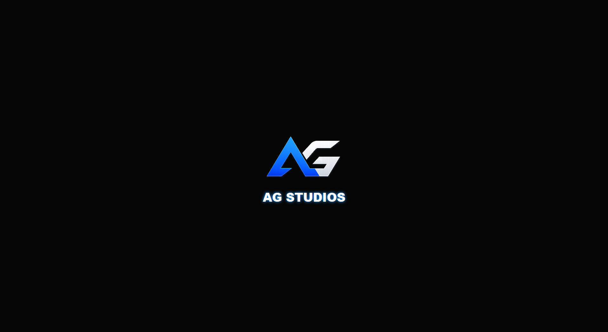
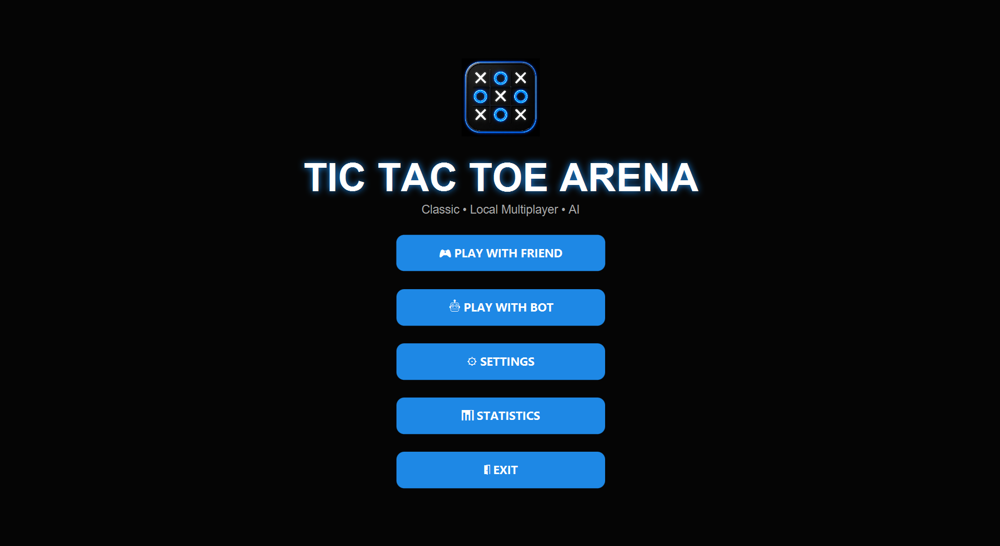
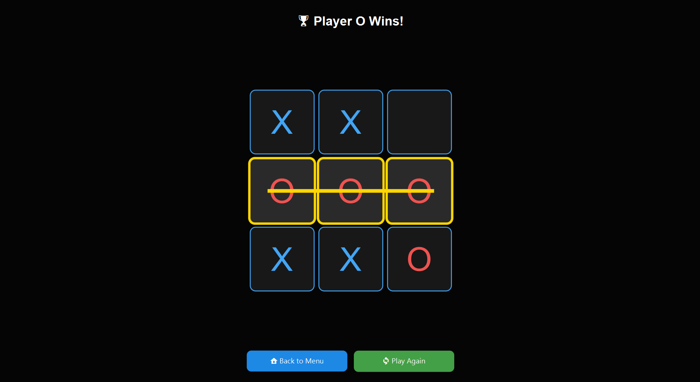
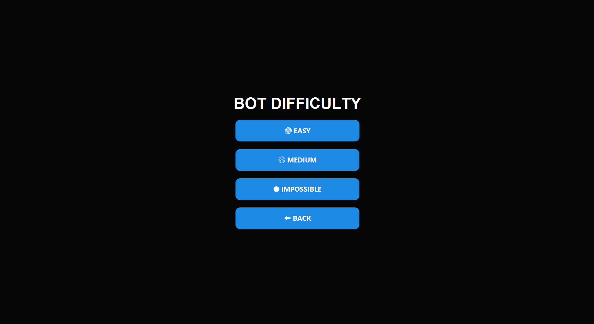
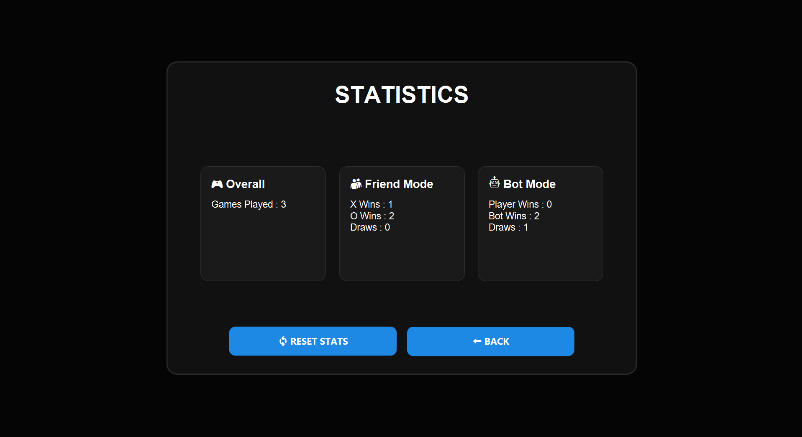
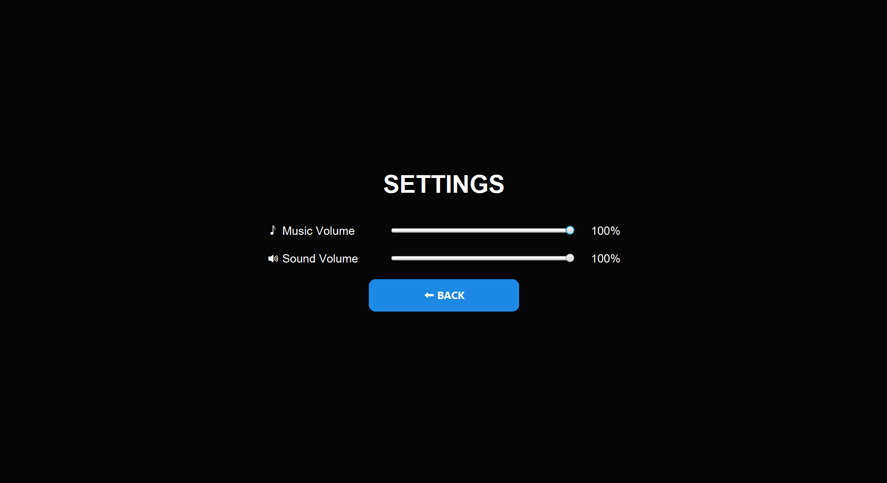

<div align="center">

# 🎮 TicTacToe Arena

### A Modern JavaFX Tic Tac Toe Experience

**Developed by AG Studios**


*A polished desktop Tic Tac Toe game built with JavaFX featuring intelligent AI, game statistics, immersive audio, and a modern user interface.*

⭐ If you like this project, consider giving it a star!

</div>

---

# 📖 About

**TicTacToe Arena** is a modern desktop implementation of the classic Tic Tac Toe game developed using **Java** and **JavaFX**.

Instead of creating a basic Tic Tac Toe clone, the project focuses on delivering a polished gaming experience through smooth animations, immersive audio, multiple AI difficulties, statistics tracking, customizable settings, and a clean modern interface.

Whether you're playing against a friend or challenging the AI, TicTacToe Arena provides a responsive and enjoyable experience.

---

# ✨ Features

## 🎮 Gameplay

- 🎯 Play with a Friend
- 🤖 Play against AI
- 🟢 Easy Difficulty
- 🟡 Medium Difficulty
- 🔴 Impossible Difficulty (Minimax AI)

---

## 🎨 User Interface

- Modern Dark Theme
- AG Studios Intro Animation
- Custom Game Icon
- Responsive Layout
- Smooth Fade Screen Transitions
- Polished Menu Design

---

## 🔊 Audio

- Background Music
- Button Click Sounds
- Move Placement Sound
- Victory Sound
- Tie Sound

---

## 📊 Statistics

Track your performance with:

- Total Games Played
- Total Wins
- Total Losses
- Total Draws
- Friend Mode Statistics
- Bot Mode Statistics

Includes:

- Reset Statistics Button

---

## ⚙️ Settings

- Music Volume Slider
- Sound Effects Volume Slider

---

# 🖼️ Screenshots

## 🎬 AG Studios Intro



---

## 🏠 Main Menu



---

## 🎮 Gameplay



---

## 🤖 Bot Difficulty



---

## 📊 Statistics



---

## ⚙️ Settings



---

# 🛠️ Built With

| Technology | Purpose |
|------------|---------|
| Java 24 | Programming Language |
| JavaFX | Desktop UI Framework |
| Gradle | Build Automation |
| Git | Version Control |
| GitHub | Repository Hosting |

---

# 📂 Project Structure

```text
src
│
├── main
│   ├── java
│   │
│   ├── agstudios
│   │   ├── audio
│   │   └── utils
│   │
│   ├── game
│   │   ├── bot
│   │   ├── GameMode.java
│   │   └── GameStats.java
│   │
│   └── ui
│
└── resources
    ├── icons
    ├── images
    ├── music
    └── sounds
```

---

# 🚀 Getting Started

## Clone the Repository

```bash
git clone https://github.com/Amogh1788/TicTacToeArena.git
```

---

## Open the Project

Open the project using **IntelliJ IDEA** or any Java IDE with Gradle support.

---

## Run

```bash
./gradlew run
```

or simply press the **Run** button in IntelliJ IDEA.

---

# 🎯 How to Play

### Friend Mode

- Player X always starts.
- Players alternate turns.
- First player to align three symbols horizontally, vertically or diagonally wins.

---

### Bot Mode

Choose one of three AI difficulties:

- 🟢 Easy
- 🟡 Medium
- 🔴 Impossible

---

# 🧠 AI Difficulty Levels

## 🟢 Easy

Random moves.

Perfect for beginners.

---

## 🟡 Medium

Uses a mix of strategic and random moves for a balanced challenge.

---

## 🔴 Impossible

Powered by the **Minimax Algorithm**, making it impossible to beat.

---

# 📦 Current Version

```
v1.1.0
```

---

# 🛣️ Roadmap

## ✅ Completed

- AG Studios Intro
- Friend Mode
- AI Opponent
- Easy / Medium / Impossible Difficulty
- Statistics System
- Settings Screen
- Background Music
- Sound Effects
- Smooth Screen Transitions
- Modern UI
- Custom Game Icon

---

## 🔜 Planned Features

- 🎨 Themes
- 🏆 Achievements
- 👤 Player Profiles
- 📜 Match History
- 🌐 Online Multiplayer
- 🥇 Leaderboards
- ✨ Gameplay Animations

---

# 🤝 Contributing

Contributions, suggestions and feedback are always welcome.

Feel free to fork the repository and submit a Pull Request.

---

# 👨‍💻 Developer

## Amogh Ghatbane

**AG Studios**

GitHub:

**https://github.com/Amogh1788**

---

# 📄 License

This project is currently licensed for personal and educational use.

---

<div align="center">

## ⭐ Thank you for checking out TicTacToe Arena!

Made with ❤️ using **Java** & **JavaFX**

© AG Studios

</div>